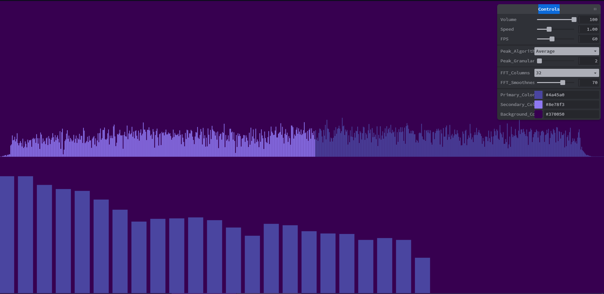

Assignment 4 - Creative Coding: Interactive Multimedia Experiences
===
## a4-creative

your hosting link e.g. https://a4-creative-matthew7758.glitch.me  
repository: [Github](https://github.com/Matthew7758/a4-creative-coding)

  
Include a very brief summary of your project here. Images are encouraged when needed, along with concise, high-level text. Be sure to include:
The goal of this application was to design a visualizer for audio files that runs natively inside a browser.
The main challenges I faced involved learning p5 in order to manipulate canvas and audio files, as well as including scripts.
One can't simply include node packages, they must be loaded on the client side. To combat this issue, I used a content delivery network called delivrjs and used script tags in my HTML before loading my custom script for the page.
Then I ran into content security policy errors which I fixed by adding custom headers with helmet-csp.
 
To run simply drag and drop a music file into the window then click on the screen to play.
 
**NOTE: FOR THE WEBSITE TO WORK OVER GLITCH YOU MUST SPECIFY HTTPS.**