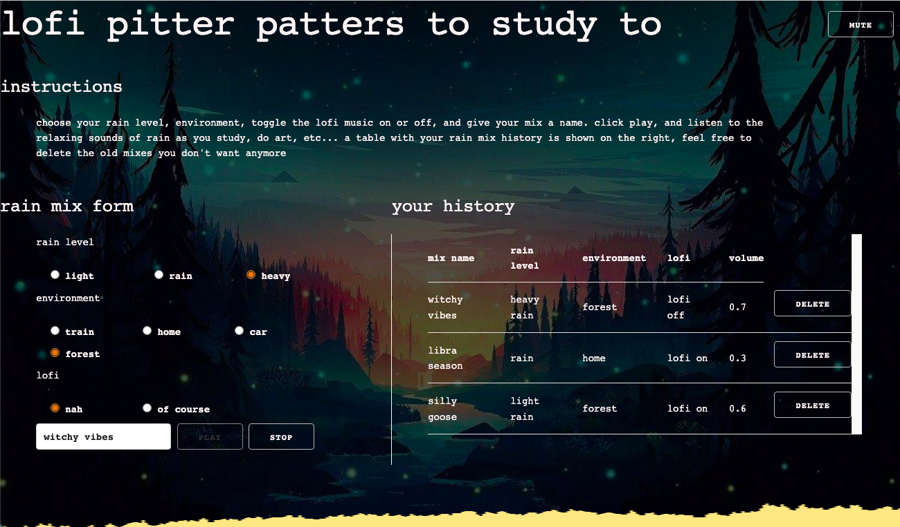

lofi pitter patters to study to
===
*author:* jyalu wu

*assignment:* assignment 4 - creative coding: interactive multimedia experiences

*website links:*

i couldn't get glitch or heroku to host the site but it works fine locally.

description
---
this website allows you to listen to chill lofi rain sounds and lofi beats while you study or code or do art or grade this assignment. you can choose the level of rain you want to listen to, whether or not you want lofi music in the background, what environment you want to be in, and also what name you want to give your playlist. a table showing your track mix history is shown on the right, and the user is able to delete old mixes they don't want anymore. on the botton of the site, you can see a visualization of the rain sounds that are playing at any given moment. in addition, the "mute" and "stop" buttons allow you to control the sounds.

website screenshot

functionalities
---
- an express server
- interactive site using canvas and web audio api
- parameters for user control of the visualization: sound (rain and lofi), color (background image), mute, and stop

challenges
---
- for previous iterations of this project i used howler.js instead of web audio. getting the visualization to connect to the sounds playing from howler.js instead of converting everything to web audio was really tricky. eventually i got it to work after discovering that the howler api exposes the webaudio context for web api.
- the biggest challenge was that i didn't have a lot of time to work on this assignment. i was out of town for personal/family reasons and found it difficult to find time to sit down and work on this project. i think that some requirements are missing as a result.

resources
---
- home wallpaper: https://wallpapercave.com/w/wp6192898
- car wallpaper: https://wallpapercave.com/w/wp4918883
- train wallpaper: https://wallpapercave.com/w/wp4334662
- forest wallpaper: https://wallpapercave.com/w/wp4649496

- rain sounds: https://mixkit.co/free-sound-effects/rain/

- howler.js: https://howlerjs.com/
- visualization code: https://github.com/cs4241-21a/cs4241-21a.github.io/blob/main/webaudio_canvas_three.md

- skeleton css framework: http://getskeleton.com

- lofi music:
Green Tea by Purrple Cat | https://purrplecat.com/
Music promoted on https://www.chosic.com/
Creative Commons Attribution-ShareAlike 3.0 Unported (CC BY-SA 3.0)
https://creativecommons.org/licenses/by-sa/3.0/
